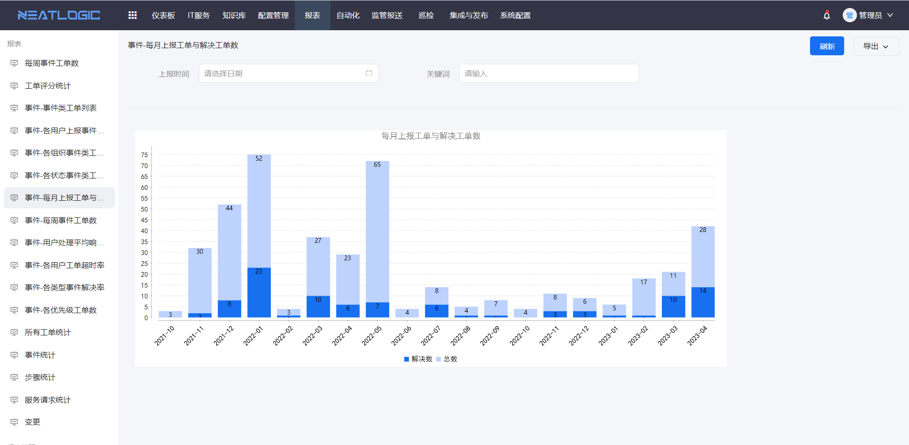

[中文](README.md) / English

    

---

## About

Neatlogic-report is a report module that supports users to configure report data sources and filtering conditions based
on their needs and scenarios. For example, using reports to summarize all work orders from the past month, the module
comes with functions such as report templates, report management, sending plans and large screen management.

## Feature

### Report Template

Report templates are composed of condition configuration, data source configuration, and content configuration. In
content configuration, the style of data source display can be defined, such as using tables, bar charts, pie charts,
etc. Report templates provide convenience for scenarios with high reuse frequency and support limiting the scope of
users through authorization.

### Report Management

Report management is based on referencing report templates, configuring filtering conditions according to requirements,
and supporting the control of visible personnel range through authorization.

The report menu list displays all the reports that the current login can view. Click on the title to view the report
details. The report display is shown in the following figure.

### Sending Plan

Sending plan supports configuring timers to periodically send report content to recipients.

### Large screen management

Large screen management can meet the needs of users for real-time data monitoring, decision-making, promotion, and
display scenarios. The characteristics of large screens include rich and diverse styles, high freedom of data sources,
real-time data updates, and multiple types of visualization components. The large screen editing page is divided into
three areas: canvas area, component selection area, and configuration area.

- Canvas area: the core editing page in the middle. It supports moving component positions and modifying component
  layers.
  
- Component selection area: a series of visual chart selections such as pie chart, line chart and column chart.
- Configuration area: When selecting a component in the canvas, the right layer presents the editing configuration of
  the component. If the component is not selected, the right layer presents the editing configuration of the component.